# Brookfield Enercare — Unified Data & Metadata Platform on Microsoft Fabric

A reference solution that moves both **data** and **business meaning** from Azure SQL Database into Microsoft Fabric and Microsoft Purview Unified Catalog, so that BI, ML, and AI (Copilot, Fabric Data Agents, Purview Q&A) can answer questions like *"What does this field mean?"*, *"How should I use this table?"*, *"What business logic applies to this KPI?"* using **authoritative metadata sourced from the SQL views and stored procedures that already encode the semantics**.

> **v2 — Propagation hub moved to OneLake.** This solution does **not** write to `sys.extended_properties` on the source database. See §3 for the rationale and the alternates considered.

---

## 1. Problem & Design Principles

| Constraint | Implication |
|---|---|
| Authoritative semantics live in **views & stored procedures**, not `sys.extended_properties` | We must *extract* meaning from SQL modules, not just read MS_Description |
| Need a **single, unified catalog** spanning SQL → OneLake → Fabric | Use Purview Unified Catalog (Fabric-native) with Atlas API enrichment |
| Need **AI to interpret** fields/measures/KPIs/business logic | Descriptions must reach Lakehouse Delta column comments and the Direct Lake semantic model so Copilot/Fabric Data Agents can use them |
| Need consistent **lineage & governance** | Mirroring preserves source identity; we register custom lineage from views/procs to Fabric assets |
| **No DDL writes on the source OLTP DB** for documentation | The hub for propagation must live outside the source DB |

**Design principles**
1. **Single source of truth for semantics:** structured headers in views & stored procedures, parsed by an extractor.
2. **OneLake is the propagation hub.** A dedicated Fabric Lakehouse (`lh_metadata`) holds the canonical metadata as Delta tables; every consumer reads from there.
3. **Propagate, don't backfill.** The same row flows to Delta column comments → Warehouse extended properties → Direct Lake semantic model descriptions → Purview asset descriptions/glossary. We do **not** write to `sys.extended_properties`.
4. **AI-assisted backfill:** where descriptions are missing, use Azure OpenAI on `sys.sql_modules.definition` to generate a draft, queued for steward approval.
5. **Mirroring over ETL** for movement (zero-ETL, no source load, near real-time).

---

## 2. Solution Architecture

```mermaid
flowchart LR
    subgraph SRC["Azure SQL Database (read-only for this pipeline)"]
        T[(Tables)]
        V[/Views with structured headers/]
        SP[/Stored Procedures with structured headers/]
        MT[(meta.* tables<br/>canonical store in source DB)]
        MV[[vw_BusinessMetadata]]
        T --> V
        V --> SP
        V -. definitions read by .-> EXTRACT
        SP -. definitions read by .-> EXTRACT
        MT --> MV
    end

    subgraph EXT["Metadata Extraction & Enrichment"]
        EXTRACT["T-SQL Extractor<br/>(02_extract_from_modules)"]
        AOAI["Azure OpenAI<br/>(gap-fill drafts, IsDraft=1)"]
        STEWARD["Steward Review<br/>(Power App / Notebook)"]
        EXTRACT --> AOAI --> STEWARD
        EXTRACT -->|MERGE upsert| MT
        STEWARD -->|approve → IsDraft=0| MT
    end

    subgraph HUB["OneLake Metadata Lakehouse — lh_metadata (HUB)"]
        REPL[["Spark MERGE<br/>03_replicate_meta_to_onelake"]]
        DA[(asset_metadata Delta)]
        DC[(column_metadata Delta)]
        DK[(kpi_metadata Delta)]
        DV[[vw_business_metadata_current<br/>SQL endpoint view]]
        REPL --> DA
        REPL --> DC
        REPL --> DK
        DA --> DV
        DC --> DV
        DK --> DV
    end

    MV --> REPL

    subgraph FAB["Microsoft Fabric — Data plane"]
        MIRROR[["Fabric Mirroring<br/>(Azure SQL → OneLake)"]]
        OL[(OneLake / Delta tables)]
        LH["Lakehouse<br/>(Bronze/Silver/Gold)"]
        WH["Warehouse"]
        SM["Direct Lake<br/>Semantic Model"]
        RPT["Power BI Reports +<br/>Copilot for Power BI"]
        AGENT["Fabric Data Agents<br/>(grounded on lh_metadata)"]
        ML["ML / Notebooks"]
        MIRROR --> OL --> LH --> SM --> RPT
        OL --> WH --> SM
        SM --> AGENT
        OL --> ML
        DV -. grounding context .-> AGENT
    end

    T --> MIRROR

    APPLY["Metadata Applier<br/>(05_apply_metadata_to_fabric)"]
    DV --> APPLY
    APPLY -->|Delta column COMMENTs| OL
    APPLY -->|sp_addextendedproperty<br/>on WAREHOUSE only| WH
    APPLY -->|TOM/TMSL via XMLA| SM

    subgraph PUR["Microsoft Purview Unified Catalog"]
        SCAN[["Fabric tenant + Azure SQL scan"]]
        ATLAS["Atlas REST<br/>(pyapacheatlas)"]
        GLOS["Business Glossary<br/>+ Sensitivity Labels"]
        LIN["Lineage<br/>(SQL view/proc → Mirror → LH → SM)"]
        SCAN --> LIN
    end

    SRC --> SCAN
    FAB --> SCAN
    DV --> ATLAS --> PUR
    APPLY -.custom Process lineage edges.-> LIN
```



---

## 3. Why we do not backfill `sys.extended_properties`

The pattern in the public reference scripts (Thought Replica blog, axial-sql, Microsoft-Purview-Automation samples) reads MS_Description from `sys.extended_properties`. That works when descriptions already live there — they don't, in Brookfield's environment. **Backfilling extended_properties from our parsed headers is plausible, but we explicitly rejected it.** Reasons:

| Concern | Detail |
|---|---|
| **DDL writes on production OLTP** | `sp_addextendedproperty` requires `ALTER` on the schema; many enterprise change-control regimes treat this as an intrusive change requiring CAB approval. |
| **Drop/recreate erases level-2 properties** | Column-level extended properties are tied to the underlying object identity. Any `CREATE OR ALTER VIEW` that internally drops/recreates the view (some deployment tools do) loses every column XP. |
| **Two sources of truth** | We'd have headers in Git **and** XPs in the DB. They will drift, and stewards will not know which to trust. |
| **Fragile across forks/replicas** | Read replicas, geo-secondaries, restored copies, and dev/test refreshes all need the XPs re-applied separately. |
| **No consumer actually requires it** | Every downstream that "reads MS_Description" can be pointed at `lh_metadata` instead, which is faster (Delta in OneLake) and richer (KPIs, glossary, drafts, sensitivity, upstream columns). |
| **Limits richness** | XP values are `sql_variant` and capped at ~7,500 bytes per property; KPI definitions, JSON, and multi-tag attributes don't fit cleanly. |

---

## 4. Alternate propagation methods considered

| # | Method | Verdict | Notes |
|---|---|---|---|
| 1 | **OneLake Metadata Lakehouse** (`lh_metadata`) — Delta tables mirrored from `meta.*` | **Chosen** | Cheap, versioned (Delta time travel), queryable via Spark + SQL endpoint, accessible to all Fabric Copilots, no source DDL. |
| 2 | **Sidecar YAML files in Git** alongside each `.sql` module; extractor reads YAML+SQL together | **Optional add-on** | Cleaner if you want to remove headers from SQL modules. Requires a CI hook to keep YAML and SQL in lock-step. Useful when DBAs object to comment blocks. See §6. |
| 3 | **Purview Unified Catalog as the canonical hub** (push everything; downstream reads Purview) | Rejected as canonical | Purview is great for governance/search but its REST API for *bulk* read is rate-limited and the data product schema is not optimized as a read-cache for Copilot grounding. We push to Purview, but it isn't the hub. |
| 4 | **Microsoft Fabric Data Catalog tags** on items | Complementary | Item-level tags only — not column-level. We use them for domain/owner badges. |
| 5 | **Open Mirroring with a custom landing payload** that includes per-column metadata in a side stream | Rejected | Reinvents Mirroring; loses the "zero-ETL" benefit. |
| 6 | **Embed metadata as JSON in extended_properties** under a custom name (e.g., `BFE_Metadata`) | Rejected | Same DDL/drop-recreate concerns as MS_Description, plus tooling doesn't natively read custom XPs. |
| 7 | **Azure SQL `system-versioned ledger` of meta.* + CDC into Fabric** | Equivalent to chosen | Adds ledger overhead and source-DB CDC config; chose plain JDBC mirror to OneLake instead. |
| 8 | **Materialize meta.* into a JSON column on each Mirrored table via Mirroring's column metadata** | Not supported | Mirroring does not expose per-column user metadata enrichment. |
| 9 | **Microsoft Fabric Eventhouse / KQL DB as the metadata hub** | Rejected | Wrong workload — descriptions are slowly-changing dimensions, not telemetry. |
| 10 | **A fully Atlas-native solution: Atlas custom types + glossary + classifications, no SQL store** | Rejected as canonical | Locks the metadata to Purview, harder to drift-detect against SQL source, harder to ground Fabric Copilot/Data Agents. |

---

## 5. Implementation Steps

### Phase 0 — Conventions (one-time)

Adopt a **structured header** in every business-meaningful view and stored procedure (or use sidecar YAML — see §6). The extractor parses these headers; if missing, Azure OpenAI proposes a draft.

See `sql/00_metadata_header_convention.sql`.

### Phase 1 — Extract semantics into the source-DB metadata catalog

Run on the source DB (or a read replica):
1. `sql/01_create_metadata_tables.sql` — creates `meta.AssetMetadata`, `ColumnMetadata`, `KpiMetadata`, `ParameterMetadata` (the canonical store).
2. `sql/02_extract_from_modules.sql` — parses view/proc headers + uses `INFORMATION_SCHEMA.VIEW_COLUMN_USAGE` to get column-level lineage.
3. `purview/ai_gap_fill.py` *(optional)* — Azure OpenAI drafts for any asset/column with no description; written with `IsDraft = 1` for steward approval.
4. `sql/04_vw_BusinessMetadata.sql` — unified read view consumed by the OneLake replicator.

### Phase 2 — Replicate metadata to the OneLake hub

Run `fabric/03_replicate_meta_to_onelake.py` in a Fabric notebook on a schedule (e.g., every 15 min). It:
- Reads `meta.*` over JDBC.
- MERGE-upserts into Delta tables in `lh_metadata` keyed on natural keys.
- Computes a row hash so subsequent runs only update changed rows.
- Exposes `lh_metadata.vw_business_metadata_current` over the Lakehouse SQL endpoint for non-Spark consumers.
- Uses Delta column mapping mode and time travel for safe schema evolution and drift audits.

### Phase 3 — Land data in Fabric (Mirroring)

In Fabric portal:
1. Create a **Mirrored Azure SQL Database** item → point at the source DB → choose tables.
2. Mirroring requires `ALTER ANY EXTERNAL MIRROR`, system-assigned MI on the SQL logical server, and `db_owner` for the mirror principal. Validate prerequisites per Microsoft Learn.
3. Once status = *Running*, mirrored Delta tables appear under the Mirrored DB's SQL analytics endpoint and as **OneLake shortcuts** you can attach to `lh_enercare_silver`.

### Phase 4 — Apply metadata to Fabric assets

Run `fabric/05_apply_metadata_to_fabric.py` in a Fabric notebook (PySpark). It now reads from `lh_metadata.vw_business_metadata_current` (no SQL crossing) and:
- Applies **Delta column comments** to Lakehouse tables (`ALTER TABLE … ALTER COLUMN … COMMENT '…'`).
- For Warehouse copies, runs `sp_addextendedproperty` against the **Fabric Warehouse only** (XPs there are local to Fabric and exposed to Fabric Copilot).
- Pushes table & column descriptions to the **Direct Lake semantic model** via TOM through the workspace XMLA endpoint.
- Tags KPIs as **measures with descriptions** so Copilot for Power BI can answer KPI questions.

### Phase 5 — Govern with Purview Unified Catalog

1. **Enable Fabric integration** for the Purview account; turn on tenant scan.
2. Run a scan over **Azure SQL DB** and the **Fabric tenant** so both source and mirrored assets are catalogued.
3. Run `purview/06_purview_push_descriptions.py` to push column-level descriptions from `lh_metadata` onto:
   - `mssql_column` qualifiedNames for source columns
   - `fabric_lakehouse_table_column` and `powerbi_dataset_column` qualifiedNames for downstream copies
4. Run `purview/07_purview_register_lineage.py` to register **custom Process lineage edges** (Fabric does not infer SP-driven transforms automatically).
5. Map descriptions to **Glossary terms** so business users find them by canonical name.
6. Apply **MIP sensitivity labels**; Fabric inherits them on mirrored & semantic model items.

### Phase 6 — Light up AI consumers

| Consumer | What it now sees |
|---|---|
| **Copilot for Power BI** (Q&A, summarize) | Table & column & measure descriptions on the Direct Lake model |
| **Copilot for Data Engineering / Warehouse** | Delta column comments on Lakehouse tables and Fabric Warehouse extended properties |
| **Fabric Data Agents** | Curated semantic model with rich descriptions; KPI definitions from procs become high-confidence answers; can be **grounded directly on `lh_metadata.vw_business_metadata_current`** for any catalog question |
| **Purview Q&A / Unified Catalog search** | Atlas-enriched descriptions, glossary terms, lineage |
| **Custom RAG** | Single endpoint: `lh_metadata` (Spark or SQL endpoint) + Atlas search API |

---

## 6. Optional: sidecar YAML instead of header comments

If your DBAs prefer that view/proc bodies stay free of long comment blocks, replace `@tag:` headers with paired YAML files in source control:

```
sql/views/customer/vw_Customer360.sql
sql/views/customer/vw_Customer360.meta.yaml
```

```yaml
# vw_Customer360.meta.yaml
asset_type: view
business_name: Customer 360
description: One row per active residential customer with current plan, lifetime value, and churn risk score.
owner: Customer Analytics
steward: jane.doe@brookfieldenercare.com
domain: Customer
grain: one row per CustomerId where IsActive = 1
refresh: hourly
sensitivity: Confidential
glossary: [Customer, Active Customer, Lifetime Value, Churn Risk]
columns:
  - name: CustomerId
    description: Surrogate key for the customer dimension.
  - name: LifetimeValueCAD
    description: Sum of net revenue to date in CAD (dbo.fn_LTV).
upstream:
  - dbo.Customer
  - dbo.Plan
```

Replace step 1.2 (T-SQL extractor) with a small Python loader that walks the YAML files and writes the same `meta.*` rows. Everything downstream is unchanged.

---

## 7. Operating model

- **Ownership:** every view/proc has `@owner` and `@steward`. CI fails the build if headers (or sidecar YAML) are missing on new modules.
- **Refresh cadence:** extractor runs hourly; OneLake replicator every 15 min; Fabric metadata applier after each replicate; Purview push nightly.
- **Drift detection:** `meta.AssetMetadata.SourceHash` is `SHA2_256(sys.sql_modules.definition)`. A daily report flags rows where the hash changed since the description was last reviewed.
- **Drafts vs published:** AI-generated rows have `IsDraft = 1`; only `IsDraft = 0` rows are projected through the OneLake hub to Fabric / Purview.
- **Rollback:** Delta time travel on `lh_metadata` lets a steward revert a bad batch in seconds (`RESTORE TABLE … TO VERSION AS OF n`).

---

## 8. File index

```
sql/
  00_metadata_header_convention.sql     -- the comment template + worked examples
  01_create_metadata_tables.sql         -- meta.* tables (canonical source-DB store)
  02_extract_from_modules.sql           -- parse headers, derive column lineage
  04_vw_BusinessMetadata.sql            -- unified read view feeding the OneLake hub
fabric/
  03_replicate_meta_to_onelake.py       -- mirror meta.* into lh_metadata Delta (HUB)
  05_apply_metadata_to_fabric.py        -- Delta comments + Warehouse XP + TOM push
purview/
  06_purview_push_descriptions.py       -- pyapacheatlas column description sync
  07_purview_register_lineage.py        -- view/proc → Lakehouse/SM custom lineage
  ai_gap_fill.py                        -- Azure OpenAI description drafts
diagrams/
  architecture.mmd                      -- Mermaid source for the diagram above
```

> Removed in v2: `sql/03_backfill_extended_properties.sql` (no longer applicable — see §3).

---

## 9. References

- Mirroring Azure SQL DB to Fabric: `learn.microsoft.com/fabric/mirroring/azure-sql-database`
- Purview governance for Fabric: `learn.microsoft.com/fabric/governance/microsoft-purview-fabric`
- Purview lineage for Fabric (column-level preview): `learn.microsoft.com/azure/purview/catalog-metadata-lineage-fabric`
- Delta column comments via Spark SQL: `learn.microsoft.com/azure/databricks/delta/delta-batch#–-add-or-modify-comments`
- TOM/TMSL for semantic model edits: `learn.microsoft.com/analysis-services/tom/introduction-to-the-tabular-object-model-tom-in-analysis-services-amo`
- Reference scripts (extended_properties pattern — *not used*): `github.com/stvflowers/Microsoft-Purview-Automation/tree/main/Samples/Azure%20SQL%20Column%20Descriptions`
